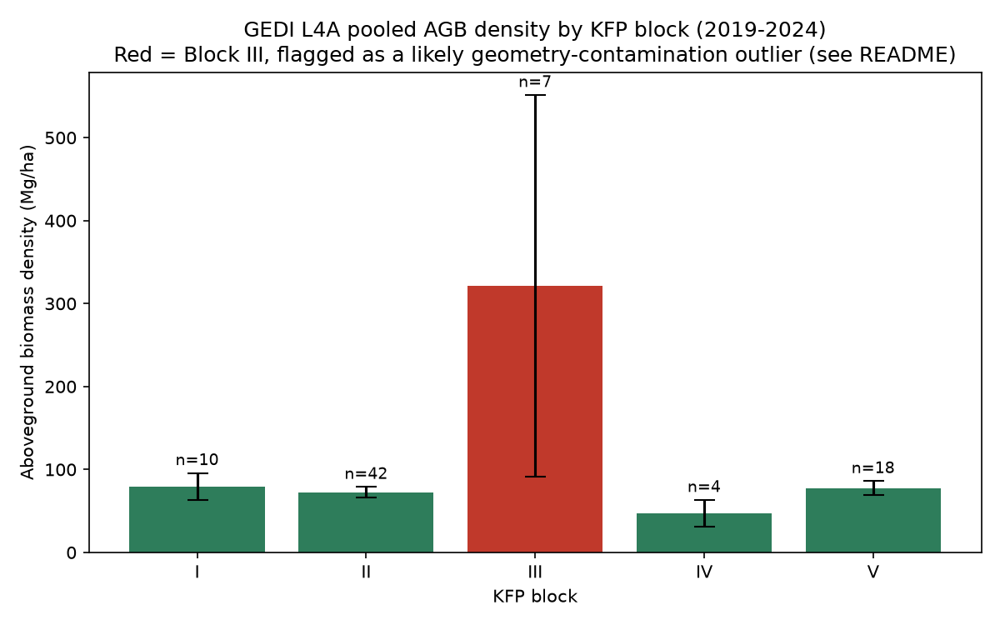
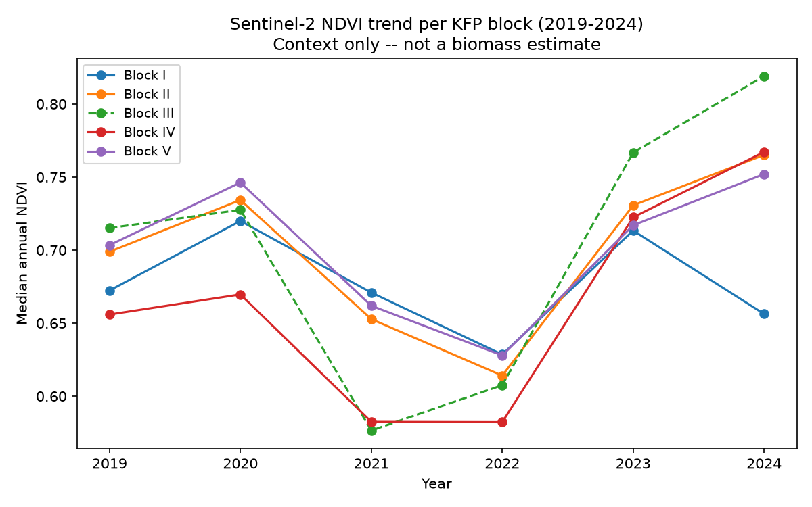
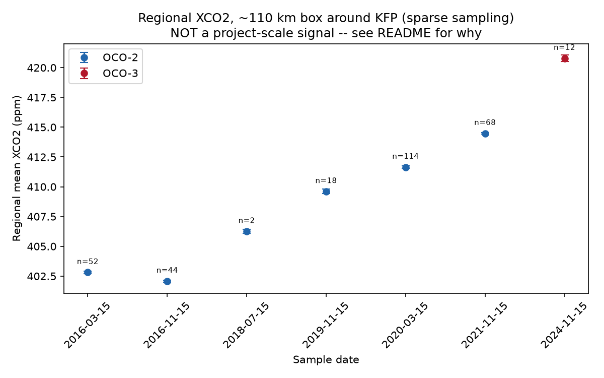
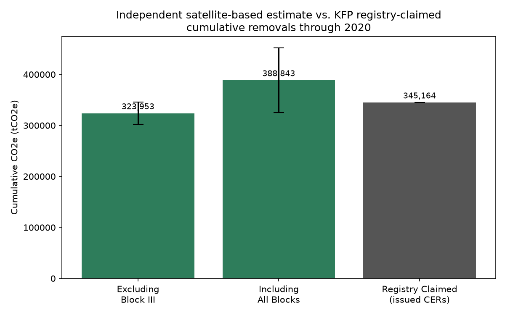

# Carbon Verification Toolkit


Independent, satellite-based measurement, reporting, and verification (MRV) of a real,
publicly documented carbon credit project: checking a registry's claimed sequestration
against GEDI biomass, Sentinel-2 canopy data, and OCO-2/3 atmospheric CO2, rather than
taking the claim at face value.

---

## Background

Voluntary and compliance carbon markets have repeatedly faced criticism for credits that
overstate actual sequestration, in part because registries have historically relied on
self-reported or ground-survey-based claims that are difficult to independently verify at
scale. This toolkit builds an independent verification pipeline against one real project
and reports the result honestly, including where the independent method itself needed
correcting along the way.

**This is a methodology demonstration, not audit-grade MRV.** No registry figures are
estimated or fabricated. Every claimed number used here comes directly from the project's
own CDM Project Design Document (PDD) and monitoring/verification reports.

### Case study: Kachung Forest Project (KFP)

| | |
|---|---|
| **Registry** | CDM Project 4653, "Kachung Forest Project: Afforestation on Degraded Lands" |
| **Location** | Kachung Central Forest Reserve, Dokolo District, Uganda |
| **Coordinates** | 1.9822–2.0422°N, 32.9153–32.9953°E |
| **Area** | 2,099 ha across 5 CDM-eligible blocks |
| **Species** | ~90% *Pinus caribaea hondurensis*; remainder eucalyptus, *Maesopsis eminii* |
| **Methodology** | AR-AM0004 v4 |
| **Registered** | 4 April 2011 |
| **Registry-claimed issued CERs** | 30,492 tCO2e (2006–2012) + 314,672 tCO2e (2013–2020) = **345,164 tCO2e cumulative** |

KFP was selected because, unlike most afforestation credits (which report only ex-ante
projections), it has **real ex-post issued CERs** backed by verified monitoring reports,
giving this toolkit an actual figure to check against rather than a projection. Hajdu et al.
(2016) previously used Landsat data to question this project's own baseline "degradation"
narrative; this toolkit extends that same spirit of independent scrutiny with newer sensors.

The project has also been the subject of documented concerns (Oakland Institute, Swedwatch,
FSC-Watch) regarding evictions and contested land-use history prior to afforestation. That
context is included here transparently, not omitted: it is part of why independent
verification of projects like this matters.

## Method

Four stages, each independently confirmed before building on it:

### Stage 1: Data access verification
Confirms GEDI L4A/L4B, Sentinel-2, and OCO-2/3 actually have usable coverage for KFP's
location and monitoring period before any analysis is built on an assumption.
→ [`scripts/stage1_data_access_verification.py`](scripts/stage1_data_access_verification.py)

### Stage 2: Biomass stage (bottom-up)
Independent aboveground biomass (AGB) estimate from GEDI L4A, quality-filtered
(`l4_quality_flag==1`, `degrade_flag==0`, `sensitivity>=0.95`) and pooled across the full
GEDI mission span (2019–2024) per KFP block, since annual granularity proved too sparse to
be statistically defensible. Sentinel-2 NDVI tracked in parallel as canopy-development
context, not as a biomass estimate.
→ [`scripts/stage2_biomass_estimation.py`](scripts/stage2_biomass_estimation.py)





### Stage 3: Atmospheric stage (top-down, honestly scoped)
A coarse **regional** (~110 km box) XCO2 cross-check using OCO-2/3, explicitly *not* claimed
as project-scale detection. KFP is far too small relative to OCO's footprint and noise
floor for that. Samples representative dates across a widened search window, since OCO's
narrow swath does not cross every region on every orbit cycle.
→ [`scripts/stage3_atmospheric_crosscheck.py`](scripts/stage3_atmospheric_crosscheck.py)



### Stage 4: Comparison
Converts the AGB estimate to total CO2e (AGB → AGB+BGB via root-to-shoot ratio → carbon
stock via carbon fraction → CO2e) and compares it against the registry's claimed cumulative
removals, with uncertainty bounds and an explicit account of what makes the comparison
approximate.
→ [`scripts/stage4_comparison_and_uncertainty.py`](scripts/stage4_comparison_and_uncertainty.py)



## Key finding

| Scenario | Independent estimate | Registry claim | Difference |
|---|---|---|---|
| Excluding Block III | 323,953 ± 21,700 tCO2e | 345,164 tCO2e | **−6.1%** |
| Including all blocks | 388,843 ± 63,259 tCO2e | 345,164 tCO2e | +12.7% |

The registry's claimed figure falls between both independent scenario bounds, closer to the
excluding-Block-III estimate, well inside the combined uncertainty band.

### The Block III finding

An early per-year biomass run produced an anomalous 457 Mg/ha reading in Block III (n=5,
statistically unusable on its own: standard error exceeded a third of the mean). The
likely cause: Block III's boundary is approximated as a circle (the PDD gives only block
centroids and areas, not surveyed polygon vertices), and this approximation plausibly clips
into a remnant, non-CDM-eligible *Gmelina arborea* plantation that the PDD explicitly
describes as excluded from the project for predating it. Sentinel-2 NDVI independently
corroborates this: Block III tracks the other four blocks closely through 2021–2022, then
diverges to become the highest-NDVI block by 2023–2024, two independent datasets pointing
the same direction.

**This matters beyond the anomaly itself.** Excluding Block III is what makes the
independent estimate corroborate the registry's claim. Pooled naively, the same pipeline
would have concluded the registry *understated* its own figure by 13%, a materially
different, less defensible finding, driven by a geometric artifact rather than a real
measurement disagreement. An independent verification method has to be able to catch its
own failure modes, not just report a number with confidence.

## Limitations

- **Block geometry is approximate.** KFP block boundaries are circular area-matched
  approximations from centroid + area data, not the true surveyed polygon: the direct
  cause of the Block III issue above. A real shapefile (e.g. from Uganda's NFA/RCMRD Forest
  Reserves geoportal) would resolve this if obtained.
- **Conversion factors are IPCC 2006 defaults** (root-to-shoot ratio 0.24, carbon fraction
  0.47), not KFP's own project-specific values from its AR-AM0004 methodology: a real,
  quantifiable source of divergence from the registry's own numbers.
- **Stock vs. net removals mismatch.** GEDI measures a biomass *stock* during 2019–2024; the
  registry's issued CERs are a *net cumulative removal* figure for 2006–2020. Comparing them
  assumes pre-project baseline biomass was near-zero (plausible per the PDD's description of
  degraded grassland/shrubland, but an assumption, not a measurement).
- **OCO-2/3 sampling is sparse by construction.** 7 of 48 candidate sample periods yielded
  usable regional soundings, a real characteristic of the satellites' narrow-swath,
  16-day-repeat orbital geometry over this specific region, not a processing gap.
- **GEDI L4A's biomass model** is selected per-pixel from a global plant-functional-type map,
  which may not perfectly classify a pine/eucalyptus plantation on former savanna/shrubland.
  Not yet surfaced or corrected for in this toolkit's output.

## Repository structure

```
05_Carbon_Verification_Toolkit/
├── .venv-carbon/ (or conda env carbon-py311, see Reproduction)
├── requirements.txt
├── README.md
├── data/
│   ├── raw/                    # downloaded GEDI/Sentinel-2/OCO granules, PDD source docs
│   └── processed/              # stage output CSVs (AGB, NDVI, XCO2, comparison table)
├── scripts/
│   ├── stage1_data_access_verification.py
│   ├── stage2_biomass_estimation.py
│   ├── stage3_atmospheric_crosscheck.py
│   ├── stage4_comparison_and_uncertainty.py
│   └── generate_figures.py
├── notebooks/
│   └── kfp_carbon_verification.ipynb   # full pipeline, narrated, run live
└── outputs/
    └── figures/                # the 4 figures embedded above
```

## Reproduction

Earth Engine and NASA Earthdata access are tied to **individual accounts**: no credentials
are stored anywhere in this repository, and none can be reused from one user to another.

**1. Environment** (Python 3.10+ required, GEDI/Earth Engine dependencies used here are
incompatible with Python 3.9):
```bash
conda create -n carbon-py311 python=3.11 -y
conda activate carbon-py311
pip install -r requirements.txt
```

**2. Google Earth Engine**
- Create a free Google Cloud project.
- Enable the Earth Engine API for it: `console.cloud.google.com/apis/library/earthengine.googleapis.com`
- Register the project for Earth Engine (noncommercial/research use):
  `console.cloud.google.com/earth-engine/configuration`
- Run `earthengine authenticate` locally, under your own Google account.
- Set `EE_PROJECT_ID` in each script (or the notebook's setup cell) to **your own** project ID.

**3. NASA Earthdata** (for Stage 3)
- Create a free account: `urs.earthdata.nasa.gov/users/new`
- Authorize the "NASA GES DISC DATA ARCHIVE" application on your profile, required
  separately from account creation.
- `earthaccess.login()` (called inside Stage 3) prompts for credentials interactively.

**4. Run the pipeline**, in order:
```bash
python scripts/stage1_data_access_verification.py
python scripts/stage2_biomass_estimation.py
python scripts/stage3_atmospheric_crosscheck.py
python scripts/stage4_comparison_and_uncertainty.py
python scripts/generate_figures.py
```
Or run `notebooks/kfp_carbon_verification.ipynb` end to end, which calls the same four
scripts as modules and narrates the results inline.

## Data sources

- Kachung Forest Project (CDM Project 4653), CCBA/CDM Project Design Document. Busoga
  Forestry Company / Green Resources AS.
- Hajdu, F., Penje, O., & Fischer, K. (2016). "Questioning the use of 'degradation' in climate mitigation: A case study of a forest carbon CDM project in Uganda." *Land Use Policy*, 59, 412–422. https://doi.org/10.1016/j.landusepol.2016.09.016
- Dubayah, R. et al. *GEDI L4A Footprint Level Aboveground Biomass Density, Version 2.1* [Data set]. NASA/ORNL DAAC. https://doi.org/10.3334/ORNLDAAC/2056
- *GEDI L4B Gridded Aboveground Biomass Density, Version 2* [Data set]. NASA/ORNL DAAC. https://doi.org/10.3334/ORNLDAAC/2017
- European Space Agency/Copernicus. Sentinel-2 Surface Reflectance (Harmonized) [Data set]. Retrieved via Google Earth Engine, accessed [add your access date].
- OCO-2 Science Team. *OCO-2 Level 2 bias-corrected XCO2, Retrospective Processing V11.2r* [Data set]. NASA/JPL, via GES DISC.
- OCO-3 Science Team. *OCO-3 Level 2 bias-corrected XCO2, Retrospective Processing v10.4r* [Data set]. NASA/JPL, via GES DISC. *(Corrected from the original "v11" — OCO-3's current Lite FP release is v10.4r, not v11; only OCO-2 is at v11.2r.)*
- IPCC (2006). *Guidelines for National Greenhouse Gas Inventories*, Vol. 4 (AFOLU).

## Citation

If you use this repository, please cite it — see [`CITATION.cff`](CITATION.cff).

## License

MIT
